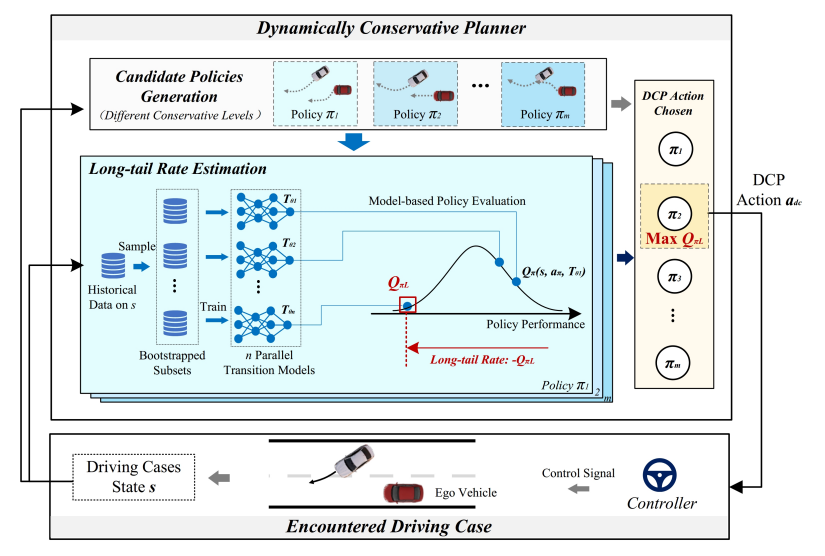
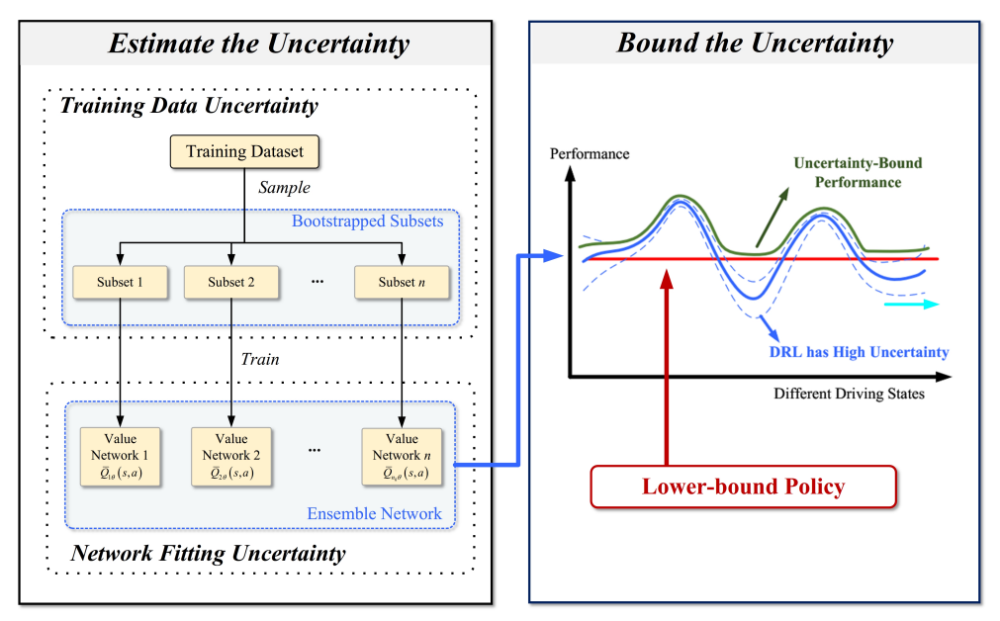
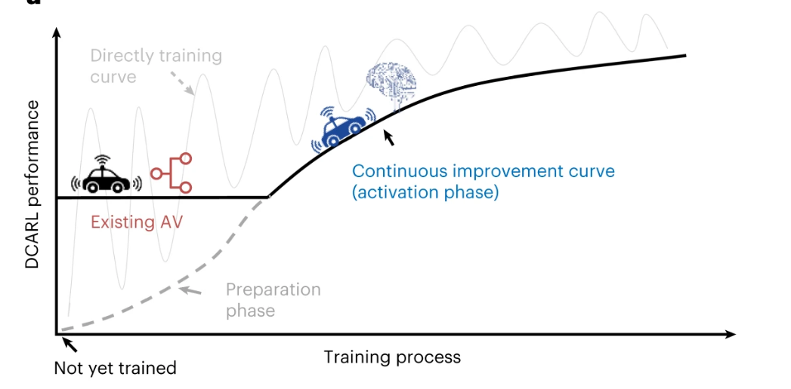








I am currently a Postdoctoral Researcher at the School of Vehicle and Mobility, Tsinghua University, where I am dedicated to developing trustworthy AI systems for real-world autonomous driving. 

My research interest includes autonomous driving, safe reinforcement learning, contiual learning.

I earned my Ph.D. from the School of Vehicle and Mobility, Tsinghua University, advised by Professor Yang Diange. My thesis introduced an online continual learning planner for autonomous vehicles, addressing the challenge of ensuring system performance in long-tail cases. 

My team and I are working with Didi Autonomous Driving, Toyota, and Dongfeng to buld large-scale trustworthy autonomous driving systems.

Please feel free to email me at zhouwt@mail.tsinghua.edu.cn. 

# 🔥 News
- *2025.09*: Our work on long-tail autonomous driving, developed at Tsinghua and deployed on Didi’s RoboTaxi, earned Didi’s top honor—the Gaia Lighthouse Outstanding Project Award—along with the employee-voted Most Popular Project Award. [News](https://mp.weixin.qq.com/s/KxPfIOW-O7xP4kJF8P119w)
- *2025.07*: We organized [a workshop about Next-level of Self-driving Vehicles in Tsinghua University](https://mp.weixin.qq.com/s?__biz=MzUyNDEzMzkzMg==&mid=2247500932&idx=1&sn=49a48ba9864810ae2b7d2af386c0bf1f&chksm=fb0c22e5a957a64cbe673a6c5188a148bbb70fd084f01fc1a4580c4582b40ca56e793319bef8&scene=27) Invited Talk: Hang Zhao from Tsinghua University, Hongyang Li from Hongkong University, Shaoshuai Shi from Didi, Junchi Yan from Shanghai Jiaotong University, Long Chen from Xiaomi EV, Xintao Yan from Hongkong University. [Talk Videos](https://space.bilibili.com/3546965931461541?spm_id_from=333.1387.follow.user_card.click)
- *2025.06*: Our paper "[DRARL: Disengagement-Reason-Augmented Reinforcement Learning for Efficient Improvement of Autonomous Driving Policy](https://arxiv.org/pdf/2506.16720)" is accepted by IROS 2025.
- *2025.03*: Our preprint paper "[Dynamically Local-Enhancement Planner for Large-Scale Autonomous Driving](https://arxiv.org/pdf/2502.21134)" is now online.
- *2024.10*: We organized a workshop about Multi-Agent Autonomous Systems in [ECCV 2024](https://eccv.ecva.net/Conferences/2024).
- *2024.09*: We organized a invited session about corner cases in autonomous driving in [ITSC 2024](https://ieee-itsc.org/2024/).
- *2024.09*: &nbsp;🎉🎉 We won the [Mcity AV Challenge](https://mcity.umich.edu/av-challenge/). The autonomous vehicle equipped with our algorithm did not collide during the entire competition.
- *2024.03*: Welcome to use our toolchains [SPIDER](https://github.com/Thu-ADLab/SPIDER) for building both data-driven and rule-based self-driving planners.
- *2023.03*: Our paper on continual learning of autonomous vehicle was published in Nature Machine Intelligence. 

# 📝 Publications 

IEEE Trans-ITS

[Dynamically conservative self-driving planner for long-tail cases](https://arxiv.org/pdf/2305.07497)

**Weitao Zhou**, Zhong Cao, Nanshan Deng, Xiaoyu Liu, Kun Jiang, Diange Yang

- This work proposes a method to automatically adjust the conservative level of self-driving vehicles according to each case’s “long-tail” rate, which provides a technique to guarantee 
 performance in unexpected driving cases without resorting to a global conservative setting. 

IEEE Trans-ITS

[Identify, estimate and bound the uncertainty of reinforcement learning for autonomous driving](https://arxiv.org/pdf/2305.07487)

**Weitao Zhou**, Zhong Cao, Nanshan Deng, Kun Jiang, Diange Yang

<!--
[**Project**](https://scholar.google.com/citations?view_op=view_citation&hl=zh-CN&user=DhtAFkwAAAAJ&citation_for_view=DhtAFkwAAAAJ:ALROH1vI_8AC) <strong></strong>
-->

-  The proposed planner can estimate and constrain performance uncertainty by itself, which quantifies potential performance drop due to insufficient training data or
network fitting errors. 

Nature Machine Intelligence

[Continuous improvement of self-driving cars using dynamic confidence-aware reinforcement learning](https://www.nature.com/articles/s42256-023-00610-y)

 Zhong Cao, Kun Jiang, **Weitao Zhou**, Shaobing Xu, Huei Peng, Diange Yang

[**Project**](https://github.com/zhcao92/DCARL) 
- We present a dynamic confidence-aware reinforcement learning (DCARL) technology for guaranteed continuous improvement. Continuously improving means that more training always improves or maintains its current performance. Our technique enables performance improvement using the data collected during driving, and does not need a lengthy pre-training phase. 

- [DRARL: Disengagement-Reason-Augmented Reinforcement Learning for Efficient Improvement of Autonomous Driving Policy](https://arxiv.org/pdf/2506.16720), **Weitao Zhou**, Bo Zhang, Zhong Cao, Xiang Li, Qian Cheng, Chunyang Liu, Yaqin Zhang, Diange Yang
 **IROS 2025**

- [Dynamically Local-Enhancement Planner for Large-Scale Autonomous Driving](https://arxiv.org/pdf/2502.21134), Nanshan Deng, **Weitao Zhou**, , Bo Zhang, Junze Wen, Kun Jiang, Zhong Cao, Diange Yang, **Preprint**

- [Long-Tail Prediction Uncertainty Aware Trajectory Planning for Self-driving Vehicles](https://arxiv.org/pdf/2207.00788), **Weitao Zhou**, Zhong Cao, Yunkang Xu, Nanshan Deng, Xiaoyu Liu, Kun Jiang, Diange Yang, **ITSC 2024**

- [An End-to-End Autonomous Driving Pre-trained Transformer Model for Multi-Behavior-Optimal Trajectory Generation], Zelin Qian, Kun Jiang,  **Weitao Zhou**, Junze Wen, Cheng Jing, Zhong Cao, Diange Yang, **ITSC 2023**

- [Integrating Deep Reinforcement Learning with Optimal Trajectory Planner for Automated Driving](https://www.researchgate.net/profile/Weitao-Zhou-4/publication/347957240_Integrating_Deep_Reinforcement_Learning_with_Optimal_Trajectory_Planner_for_Automated_Driving/links/632f0f5686b22d3db4dbdf2b/Integrating-Deep-Reinforcement-Learning-with-Optimal-Trajectory-Planner-for-Automated-Driving.pdf), **Weitao Zhou**,  Kun Jiang, Zhong Cao, Nanshan Deng, Diange Yang, **ITSC 2020**

- [Autonomous driving policy continual learning with one-shot disengagement case], Zhong Cao, Xiang Li, Kun Jiang, **Weitao Zhou**, Xiaoyu Liu, Nanshan Deng, Diange Yang, **IEEE Trans-IV**

- [LiDAR-based Object Detection Failure Tolerated Autonomous Driving Planning System], Zhong Cao, Jiaxin Liu, **Weitao Zhou**, Xinyu Jiao, Diange Yang, **IV 2021**

- [Decision-Oriented Driving Scenario Recognition Based on Unsupervised Learning], Nanshan Deng, Kun Jiang, Zhong Cao, **Weitao Zhou**, Diange Yang, **CICTP 2021**

- [Lane Change Intention Recognition for Intelligent Connected Vehicle Using Trajectory Prediction], Shengjie Kou, Kun Jiang, Weiguang Yu, Ruidong Yan, **Weitao Zhou**, Mengmeng Yang, Diange Yang, **CICTP 2020**

- [Adapt the Driving Policy to Local Traffic before Entering the New Area], Nanshan Deng,  Zhong Cao,  **Weitao Zhou**, Kunjiang, Diange Yang, **ITSC 2021**

<!--
# 🎖 Honors and Awards
- *2021.10* Lorem ipsum dolor sit amet, consectetur adipiscing elit. Vivamus ornare aliquet ipsum, ac tempus justo dapibus sit amet. 
- *2021.09* Lorem ipsum dolor sit amet, consectetur adipiscing elit. Vivamus ornare aliquet ipsum, ac tempus justo dapibus sit amet. 

# 📖 Educations
- *2019.09 - 2023.06*,  PhD, Tsinghua University, Beijing.
- *2016.09 - 2019.06*,  Master, Beihang University, Beijing. 

# 💬 Invited Talks
- *2021.06*, Lorem ipsum dolor sit amet, consectetur adipiscing elit. Vivamus ornare aliquet ipsum, ac tempus justo dapibus sit amet. 
- *2021.03*, Lorem ipsum dolor sit amet, consectetur adipiscing elit. Vivamus ornare aliquet ipsum, ac tempus justo dapibus sit amet.  \| [\[video\]](https://github.com/)
-->

# 💬 Academic Service
- **Reviewer**, IEEE T-ITS, IEEE T-IV, ICRA, ITSC, IROS, ECCV.
- **Program Committee**, ITSC 2024 Corner Cases in Self-driving Vehicles Invited Session, ECCV 2024 Multi-Agent Autonomous Systems Workshop, SAECCE Annual Conference High Precision Map Forum.

# 💻 Internships
- *2023.04 - 2023.10*, [Didi Autonomous Driving](https://www.didiglobal.com/science/intelligent-driving), China.
- *2018.09 - 2019.02*, Baidu Apollo, China.
- *2017.06 - 2018.03*, Idriverplus, China.

